# 4.集合类

集合：提供一种数据容量可变的储存空间， 如ArrayList

Collection也叫单链集合，List可重复，Set不可重复

Map也叫单链集合

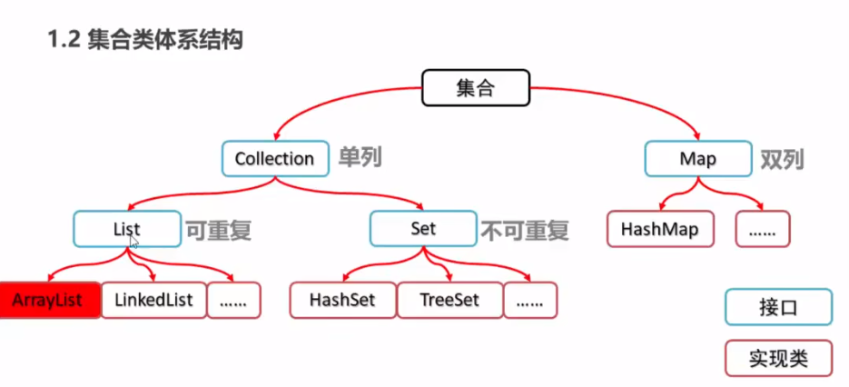

## 4.1 Collection

是单列集合的顶层接口，表示一组对象，这些对象被称为collection的元素

多态的方式创建collection

```java
Collection<String> c = new ArrayList<String>()
```

### 4.1.1 Collection集合常用方法

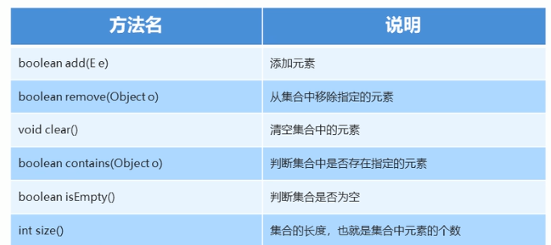

### 4.1.2 Collection集合遍历


```java
Iterator<String> it = c.iterator();
```

## 4.2 List集合

有序集合也称为序列

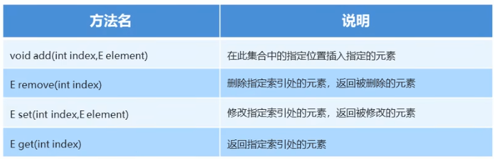

### 4.2.1 修改并发异常

```java
Iterator<String> it = list.iterator();
while(it.hasNext()){
	String s = it.next();
	if(s.equals("1")){
		it.add("2");
	}
}
```

因为modCount和expectedModCount会在add后变不同，所以报错

解决方式：

```java
for(int i=0; i<list.size(); i++){
	String s = list.get(i);
	if(s.equals("1")){
		it.add("2");
	}
}
```

### 4.2.2 ListIterator

允许从任意方向迭代

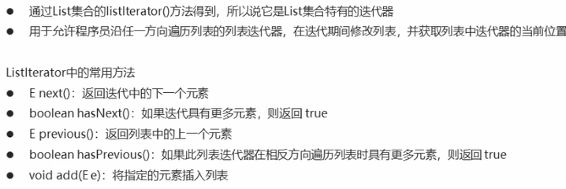

其不会产生修改并发异常（add有修改方法）

### 4.2.3 增强for语句

简化数组和collection的遍历，本质为iterator

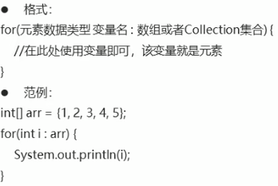

### 4.2.4 子类特点

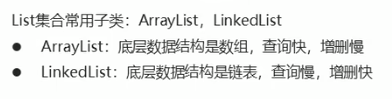

### 4.2.5 LinkedList的特有功能

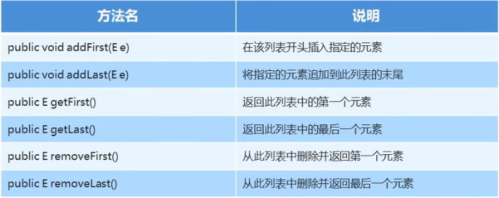

## 4.3 Set集合

没有特殊的方法和collection相同，没有重复的元素

```java
Set<String> set = new HashSet<String>();
```

### 4.3.1 哈希值

JDK根据对象的地址或字符串或数字算出的int的类型，Object类有方法可获取其值

```java
a.hashCode()
```

通过重写使不同的对象的哈希值相同（String）

### 4.3.2 Hashset

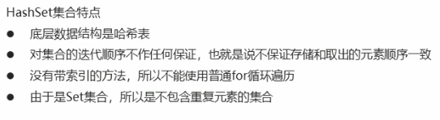

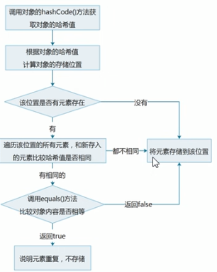

#### 4.3.2.1 LinkedHashset

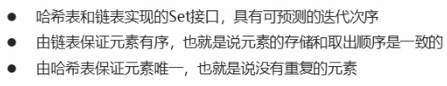

### 4.3.3 TreeSet

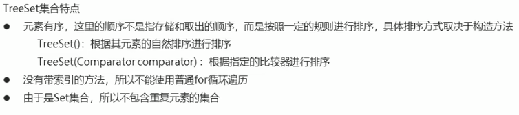

#### 4.3.3.1 自然排序Comparator

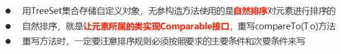

```java
@Override
public int compareTo(Student s){
    int num = this.age - s.age;
    int num2 = num == 0? this.name.compareTO(s.name):num;
    return num2;
}
```

#### 4.3.3.2 比较器排序

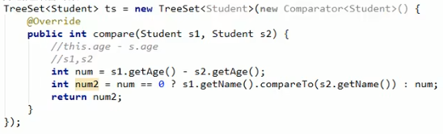

## 4.4 Map集合


```java
Map<String, String> map = new HashMap<String, String>();
```

### 4.4.1 Map的基本功能

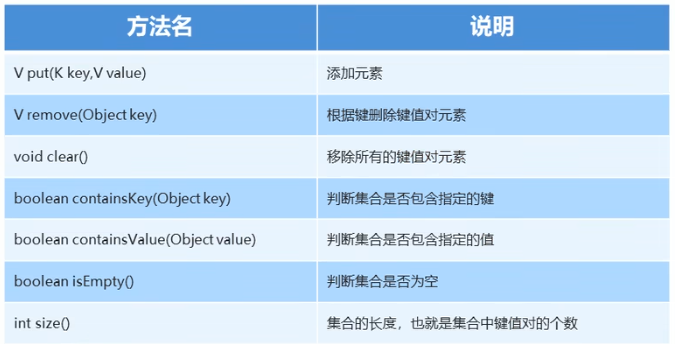

### 4.4.2 Map的获取功能

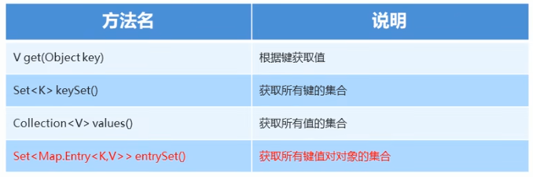

entrySet()?????

### 4.4.3 Map的遍历

```java
Map<String,String> map = new Hashmap<String,String>();
Set<String> set = map.keySet();
for(String key: set){
	String values = map.get(key);
	
}
```

```java
Map<String,String> map = new Hashmap<String,String>();
Set<Map.Entry<String, String>> entrySet = map.entrySet();
for(Map.Entry<String, String> me:entrySet){
    String key = me.getKey();
    String values = me.getValue();
}
```

## 4.5 Collections

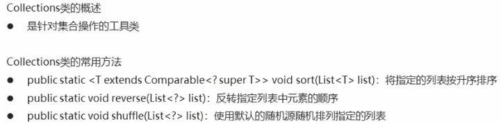
