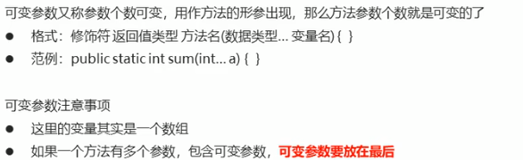

# 5. Java泛型


把运行期间的问题提前到编译期间，避免了强制类型转换

## 5.1 泛型类

```java
public class name<T>{
}
```

## 5.2 泛型方法

```java
public class name{
	public <T> void show(T t){}
}
```

直到调用方法才确定类型

## 5.3 泛型接口

```java
public interface name<T>{
	public void show(){}
}
```

```java
public NameImpl<T> implements name<T>{
	@override
	public void show(){}
}
```

## 5.4 类型通配符


## 5.5 可变参数




